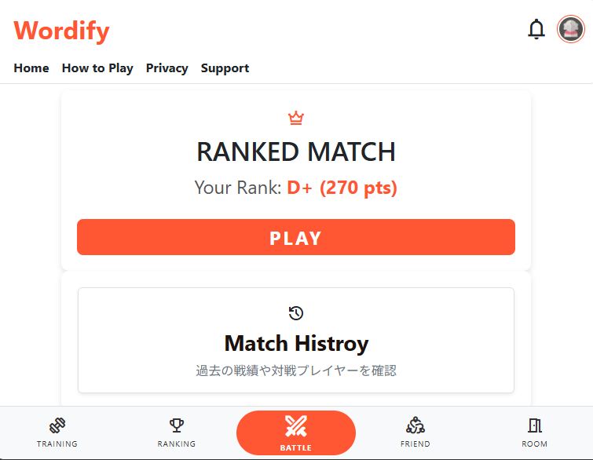
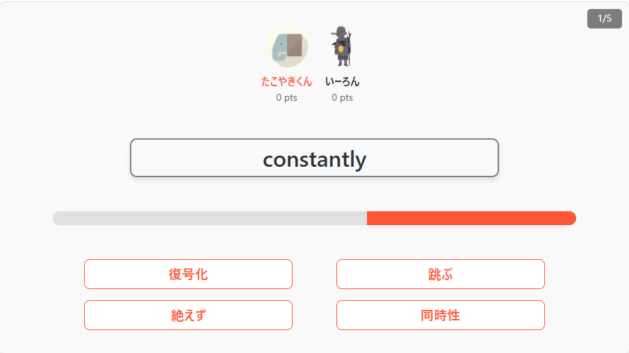
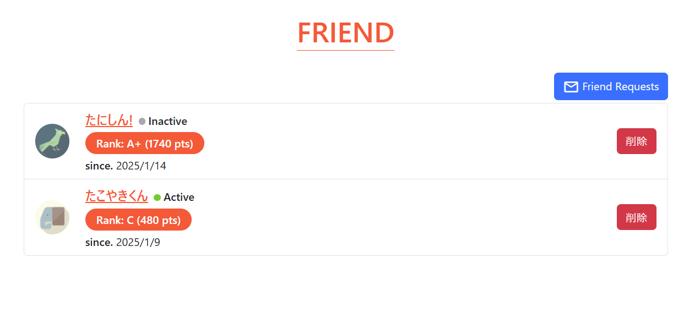
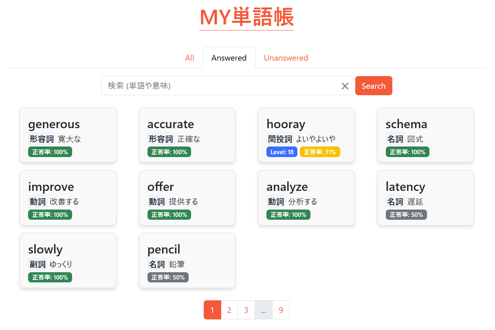

# オンライン単語対戦ゲーム

英単語学習をリアルタイムオンライン対戦形式で楽しめるWebアプリケーション

[](https://dotnet.microsoft.com/)
[](https://learn.microsoft.com/dotnet/csharp/)
[](https://dotnet.microsoft.com/apps/aspnet/signalr)
[](https://www.microsoft.com/sql-server)
[](LICENSE)

## 📝 プロジェクト概要

英語学習の継続が難しいという課題に対し、「対戦」という要素を加えることで学習意欲を高めることを目的としたアプリです。
最大4人でのリアルタイム対戦、ランクシステム、フレンド機能などを実装し、ゲーム感覚で英単語を学習できます。

**ターゲットユーザー**: 小学校高学年以上の英語学習者、友達やライバルと競い合いながら学習したい人

## 🎮 主な機能

### リアルタイムオンライン対戦
- **ランクマッチ**: ランダムマッチングで最大4人対戦、ランクポイントを賭けた真剣勝負
- **ルームマッチ**: 友達同士で気軽に遊べるプライベート対戦
- **リアルタイム同期**: SignalRによる即座の状態同期と対戦進行

### 学習機能
- **トレーニングモード**: カテゴリー・レベル・苦手単語から選んで一人学習
- **4択クイズ形式**: デバイス間の入力差を考慮した公平な形式
- **My単語帳**: 学習履歴と単語の意味ごとの正答率を記録

### ソーシャル機能
- **フレンド機能**: ユーザー検索、リクエスト送受信
- **全国ランキング**: ランクポイントによるリーダーボード
- **通知システム**: フレンドリクエストやルームマッチの招待通知

## 🎯 デモサイト
 - https://wordify-ggbud6hnf5emd3fg.japanwest-01.azurewebsites.net/
   - アクセス/ログインができない場合は、数分程度時間をおいて再度お試しください。

### スクリーンショット





## 🛠️ 使用技術

### バックエンド
- **ASP.NET Core 8.0** - Webフレームワーク
- **SignalR** - リアルタイム通信
- **Entity Framework Core** - ORM
- **SQL Server** - データベース
- **ASP.NET Core Identity** - 認証・認可

### フロントエンド
- **Razor Pages (CSHTML)** - サーバーサイドレンダリング
- **JavaScript (Vanilla)** - クライアントサイドロジック
- **CSS** - スタイリング
- **SignalR JavaScript Client** - WebSocket通信

## 🔧 技術的な工夫

### 1. SignalRによる堅牢なリアルタイム対戦システム

**課題**: 
ネットワーク切断、ページリロード、複数タブでの同時接続など、様々なエッジケースへの対応が必要

**実装内容**:

#### 接続管理
- 同一ユーザーの重複接続を検知し、新しい接続を優先
- 古い接続を自動的に無効化して整合性を保つ

#### 状態復帰機能
- **対戦前の待機中のリロード**: 一度退室して再入室扱い
- **クイズ中のリロード**: 結果発表までに完了すれば復帰可能
- **ページを閉じた場合**: 結果発表までに戻れば再開可能

#### 部屋の状態管理
- ホスト離脱時の自動委譲（部屋内の他ユーザーがホストに）
- 全員退室時の部屋自動削除
- 重複した回答の無視処理

#### タイミング制御
- サーバー側で回答受付順序を厳密に管理
- 回答時間を記録
- 早く正解したプレイヤーほど高得点（例. 1位: 20pt, 2位: 10pt, 3位: 5pt, 4位: 2pt）

### 2. クライアント主導の対戦進行

**特徴**:
サーバー側で待機処理を使わず、クライアントが全ての進行を制御

**フロー**:

1. クライアントが問題を要求
1. サーバーが全クライアントに問題を一斉送信
1. クライアントが回答を送信（制限時間内）
1. サーバーが回答を集計
1. クライアントが正解を要求
1. サーバーが正解とポイントを一斉送信

### 3. 柔軟な設定管理
```appsettings.json```で以下を調整可能：

- 問題数
- 制限時間
- ポイント配分（順位ごとの獲得ポイント、ランクポイント）

詳細は [LearningWordsOnline/README.md](LearningWordsOnline/README.md) を参照してください。

## 📂 プロジェクト構成
```
tango-taisen/
├── LearningWordsOnline/     # メインWebアプリケーション
├── SharedModels/            # 共通モデルライブラリ
├── WordImporter/            # 単語データインポートツール
├── SPECIFICATION.md         # 詳細仕様書
└── README.md                # 本ファイル
```
詳細な仕様は [SPECIFICATION.md](SPECIFICATION.md) を参照してください。

## 📊 開発情報

- **開発期間**: 8ヶ月
- **開発体制**: 個人開発
- **開発環境**: Windows, Visual Studio

## 🚀 セットアップ

### 必要な環境
- .NET 8.0 SDK
- SQL Server 

**クイックスタート**
```bash
# リポジトリのクローン
git clone https://github.com/shamshikie/tango-taisen.git
cd tango-taisen/LearningWordsOnline

# アプリケーションの起動
dotnet run
```
詳細は [LearningWordsOnline/README.md](LearningWordsOnline/README.md) を参照してください。

## ⚠️ 注意事項
これは学習目的で開発した初めてのWebアプリです。
そのため、CSRF、XSS、CSPといったセキュリティ対策が十分にできていません。余裕があれば修正するかもしれません。

## 📄 ライセンス
このプロジェクトはMITライセンスの下でライセンスされています。

## 使用している素材

このプロジェクトでは以下の素材を使用しています。

- **アイコン画像**: [Flaticon](https://flat-icon-design.com)

## 👤 作成者
[@shamshikie](https://github.com/shamshikie)
